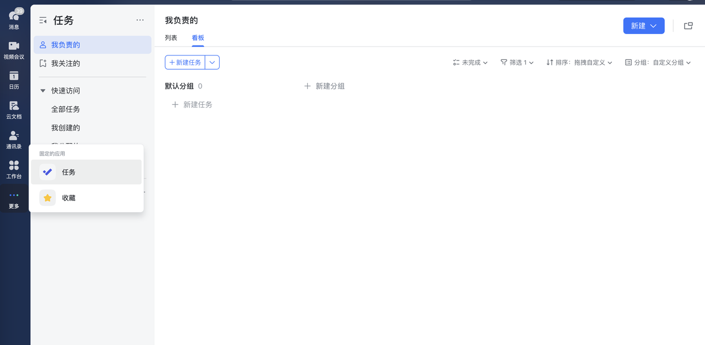

# interview-todoList
The Interview with TodoList

语言必须Typescript、框架不限、数据库不限、接口文档
实现一个TodoList, 可参考飞书的任务功能。
仅需要列表、列表需要考虑TodoList的全部功能、不需要分组、不需要协作清单
- 需要实现一下功能
  - 增删改查
  - 修改历史记录
  - 内容筛选（时间段、创建人）
  - 支持排序（创建时间、计划完成时间、创建者、ID）
  - 支持评论、@他人、消息提醒（无需实现具体功能、数据库表结构设计需要体现）
- 部署采用dockerfile（数据库可使用docker构建）
