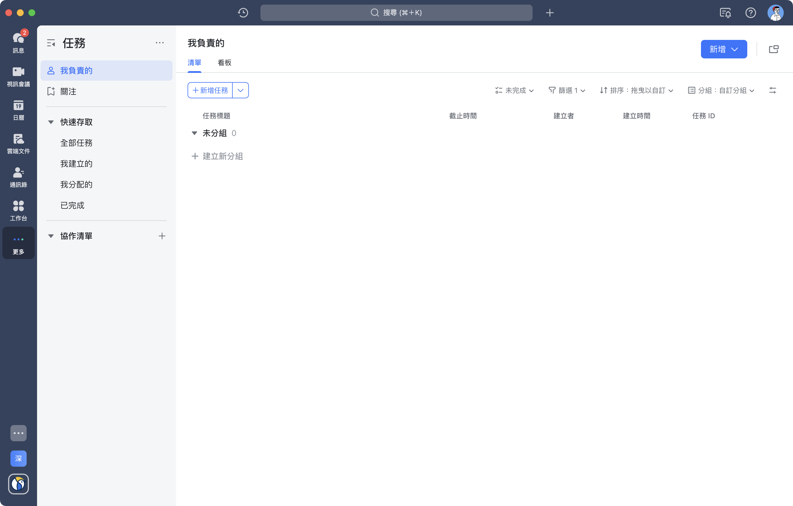

# interview-todoList
The Interview with TodoList

- 語言 Typescript
- （如果是全端）前端框架優先 React
- 後端框架優先 Nest.js
- 資料庫不限語言
- 需要實現API文件

實作一個TodoList, 可參考[Lark](https://www.larksuite.com/)的任務功能。
只需要清單、清單需要考慮TodoList的全部功能、不需要分組、不需要協作清單
- 需要實現以下功能
   - 註冊／登入
   - 可以多人分享任務的團隊
   - 任務增刪改查
     - 任務建立後可指派執行人及關注人
     - 登入的使用者需要可以看見自己的任務、被指派給自己執行的任務、自己有在關注的任務
     - 任務的子任務，子任務與任務結構相同，子任務完成後自動完成主任務
   - 顯示任務歷史紀錄
     - 可以新增評論在歷史紀錄中
   - 內容篩選（時段、創作人、任務人）
   - 支援排序（建立時間、計劃完成時間、創建者、ID）
- 以下功能使用文字敘述規劃schema架構、流程（包括使用的功能、服務等）即可
   - 實現訊息提醒任務即將到期
   - 定時重複任務
- 部署採用dockerfile（資料庫可使用docker建置）
